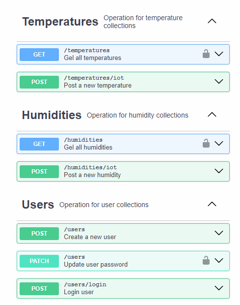
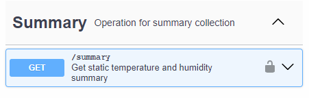

# Back-End - Agro Guard
### Aplicação cujo objetivo é auxiliar os produtores na sua plantação, disponibilizando dados da temperatura e umidade.

## Objetivo
<p> Esse repositório concentra todas as informações da API do projeto.  </p>

## Documentação
<p>Acesse a documentação da API no link</p>
<p><a href="https://github.com/GuihCFerreira/PI---BackEnd---Documentation/">Repositório da documentação da API</a></br></p>

## TecnologiaS
<p> - Node.js</br>
    - Hapi.js</br>
    - Joi </br>
    - Mongoose </br>
    - JWT
</p>

## Rotas
</br>
</br>

## Teste o projeto
```bash
# Clone este repositório
$ git clone <https://github.com/GuihCFerreira/PI--BackEnd>

# Acesse a pasta do projeto no terminal/cmd
$ cd PI--BackEnd

# Instale as dependências
$ npm install

# Execute a aplicação 
$ npm run start

# O servidor inciará na porta:5000 - acesse <http://localhost:5000>
```

## Criando um banco de dados
No Google pesquise por MongoDB e crie uma conta grátis no MongoDB Atlas, após isso crie uma database.
Click em connect e selecione a opção Driver, escolha a opção DRIVER e copie a string de conexão selecionando NodeJS como provedor.

## Crie as variáveis de ambiente
```bash
# Instale a dependencia
$ npm install dotenv

```
Crie um arquivo chamado ```.env ``` e crie as variavéis 

```bash
# seu usuário do banco de dados
DB_USER

# sua senha do banco de dados
DB_PASSWORD

# nome da database a ser usada
DB_DATABASE

# chave para criptografar o token JWT
KEY_TOKEN
```

### Conectando ao MongoDB
Em /config/db.js, cole sua string de conexão com o banco de dados e troque seu user, password e nome da database pelas suas variáveis de ambiente.

## Desenvolvido
<p>Todo o projeto foi desenvolvido pelos alunos: </br></p>
<p>Cayk Andrade Magnani,</br>Guilherme de Carvalho Ferreira e</br> Lucas Gean dos Santos.</p> 
